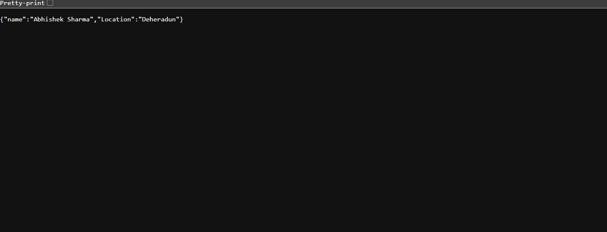
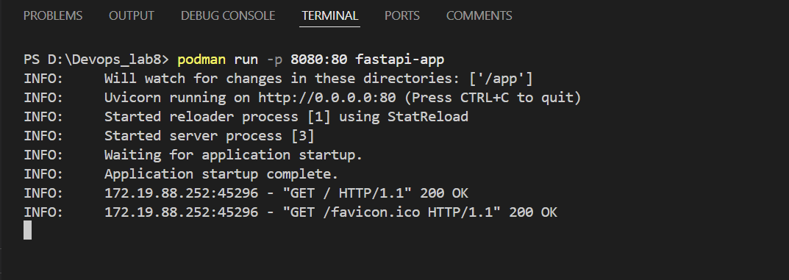
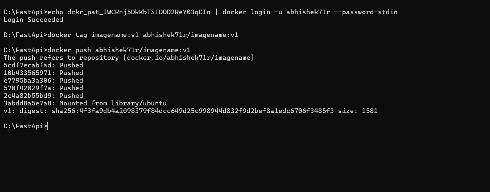
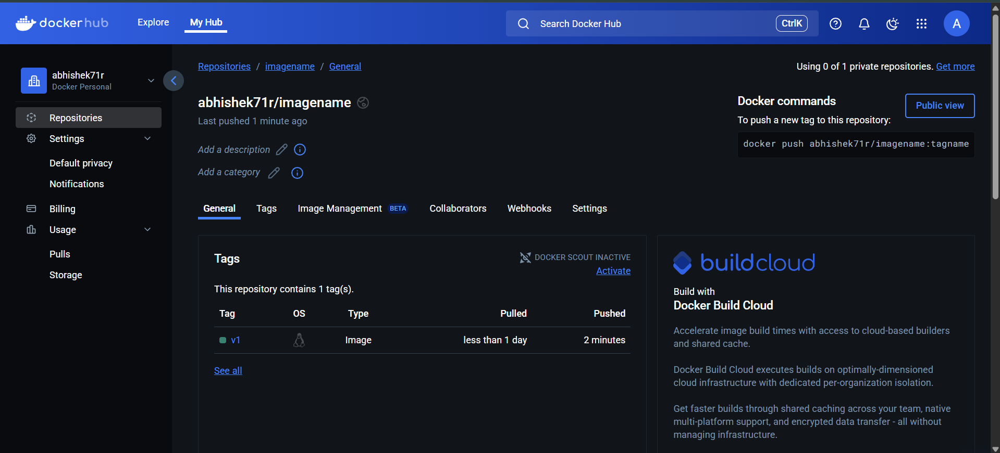
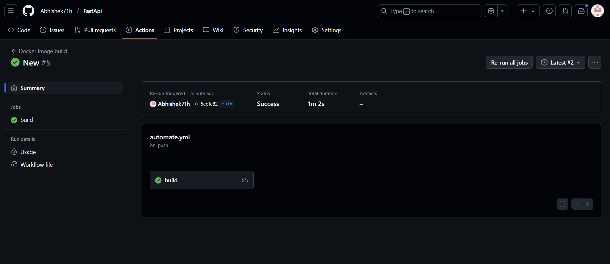

# FastApi with Podman 

Prerequisites

Ensure you have the following installed:

Python 3.11+

Podman (installed and configured for rootless mode)

```bash
pip install fastapi uvicorn
```



Running the FastAPI Application <br>

Start the FastAPI application with Uvicorn: <br>
```bash
uvicorn main:app --host 0.0.0.0 --port 8000 --reload
```

Running with Podman<br>
Build the Podman image:<br>
```bash
podman build -t fastapi-app .
```

Run the container:<br>
```bash
podman run -p 8000:8000 fastapi-app
```

SCREENSHOT



# CMD pipenv run uvicorn main:app --host 0.0.0.0 --port 80
CMD pipenv run python3 ./main.py
```
### build image using docker

`docker build -t imagename:v1 .`

check docker image
`docker images`

test docker image and run docker container
`docker run imagename`


### Github Actions for docker image creation 
`.github/workflows/DockerBuild.yml`
```yml
name: Docker image build

on: push
    


jobs:
    build:

        runs-on: ubuntu-latest

        steps: 
            - uses: actions/checkout@v1
            - name: Build & Push Image
              run: |
                echo ${{ secrets.DOCKERTOKEN }} | docker login -u "prateekrajgautam" --password-stdin
                docker build -t prateekrajgautam/upesmajorproject:v0.1 .
                docker push prateekrajgautam/upesmajorproject:v0.1

```


---
# docker token
To generate a token for a **Docker registry**, follow these steps based on your specific registry type:


### **1. Docker Hub (Public Registry)**
Docker Hub uses **Personal Access Tokens (PATs)** instead of passwords for authentication.

#### **Steps:**
1. **Go to Docker Hub**: [https://hub.docker.com/](https://hub.docker.com/)
2. **Sign in** with your Docker account.
3. Click on your **profile** (top-right corner) → **Account Settings**.
4. Navigate to **Security** → **Access Tokens**.
5. Click **Generate Token**.
6. Give it a **name**, set the **permissions**, and click **Generate**.
7. Copy the **token** (it will not be shown again).

#### **Use the Token for Login:**
```sh
docker login -u <your-docker-username> --password-stdin
```
Then, enter the **token** when prompted.

---

### **2. Private Docker Registry (Self-Hosted)**
If you're using a self-hosted **Docker Registry (Harbor, JFrog, Nexus, etc.)**, the steps depend on the platform.

#### **Generic Token Generation via HTTP API**
For a private Docker registry, you can get a token using basic authentication:

```sh
curl -u <username>:<password> https://<your-registry>/v2/token
```

#### **Harbor Registry**
1. Log in to **Harbor Web UI**.
2. Go to **User Profile** → **Robot Accounts** (or API Tokens).
3. Generate a **new token**.
4. Use it to log in:
   ```sh
   docker login <harbor-registry-url> -u robot$<username> --password <token>
   ```
SCREENSHOT



#### **OUTPUT**
SCREENSHOT



